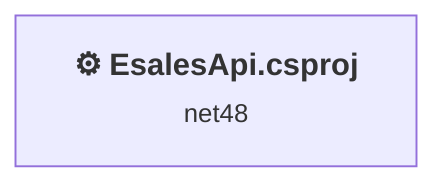
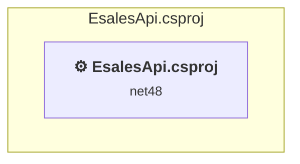

# Projects and dependencies analysis

This document provides a comprehensive overview of the projects and their dependencies in the context of upgrading to .NETCoreApp,Version=v10.0.

## Table of Contents

- [Executive Summary](#executive-Summary)
  - [Highlevel Metrics](#highlevel-metrics)
  - [Projects Compatibility](#projects-compatibility)
  - [Package Compatibility](#package-compatibility)
  - [API Compatibility](#api-compatibility)
- [Aggregate NuGet packages details](#aggregate-nuget-packages-details)
- [Top API Migration Challenges](#top-api-migration-challenges)
  - [Technologies and Features](#technologies-and-features)
  - [Most Frequent API Issues](#most-frequent-api-issues)
- [Projects Relationship Graph](#projects-relationship-graph)
- [Project Details](#project-details)

  - [EsalesApi\EsalesApi.csproj](#esalesapiesalesapicsproj)

## Executive Summary

### Highlevel Metrics

| Metric | Count | Status |
| :--- | :---: | :--- |
| Total Projects | 1 | All require upgrade |
| Total NuGet Packages | 40 | 11 need upgrade |
| Total Code Files | 66 |  |
| Total Code Files with Incidents | 23 |  |
| Total Lines of Code | 7179 |  |
| Total Number of Issues | 847 |  |
| Estimated LOC to modify | 804+ | at least 11.2% of codebase |

### Projects Compatibility

| Project | Target Framework | Difficulty | Package Issues | API Issues | Est. LOC Impact | Description |
| :--- | :---: | :---: | :---: | :---: | :---: | :--- |
| [EsalesApi\EsalesApi.csproj](#esalesapiesalesapicsproj) | net48 | 🔴 High | 34 | 804 | 804+ | Wap, Sdk Style = False |

### Package Compatibility

| Status | Count | Percentage |
| :--- | :---: | :---: |
| ✅ Compatible | 29 | 72.5% |
| ⚠️ Incompatible | 7 | 17.5% |
| 🔄 Upgrade Recommended | 4 | 10.0% |
| ***Total NuGet Packages*** | ***40*** | ***100%*** |

### API Compatibility

| Category | Count | Impact |
| :--- | :---: | :--- |
| 🔴 Binary Incompatible | 562 | High - Require code changes |
| 🟡 Source Incompatible | 227 | Medium - Needs re-compilation and potential conflicting API error fixing |
| 🔵 Behavioral change | 15 | Low - Behavioral changes that may require testing at runtime |
| ✅ Compatible | 4949 |  |
| ***Total APIs Analyzed*** | ***5753*** |  |

## Aggregate NuGet packages details

| Package | Current Version | Suggested Version | Projects | Description |
| :--- | :---: | :---: | :--- | :--- |
| Antlr | 3.5.0.2 |  | [EsalesApi.csproj](#esalesapiesalesapicsproj) | Needs to be replaced with Replace with new package Antlr4=4.6.6 |
| Autofac | 4.6.2 |  | [EsalesApi.csproj](#esalesapiesalesapicsproj) | ✅Compatible |
| bootstrap | 3.3.7 | 5.3.8 | [EsalesApi.csproj](#esalesapiesalesapicsproj) | NuGet package contains security vulnerability |
| BouncyCastle | 1.8.9 | 1.8.9 | [EsalesApi.csproj](#esalesapiesalesapicsproj) | NuGet package contains security vulnerability |
| jQuery | 3.3.1 | 3.7.1 | [EsalesApi.csproj](#esalesapiesalesapicsproj) | NuGet package contains security vulnerability |
| Microsoft.AspNet.Cors | 5.2.7 |  | [EsalesApi.csproj](#esalesapiesalesapicsproj) | NuGet package functionality is included with framework reference |
| Microsoft.AspNet.Mvc | 5.2.7 |  | [EsalesApi.csproj](#esalesapiesalesapicsproj) | NuGet package functionality is included with framework reference |
| Microsoft.AspNet.Razor | 3.2.7 |  | [EsalesApi.csproj](#esalesapiesalesapicsproj) | NuGet package functionality is included with framework reference |
| Microsoft.AspNet.Web.Optimization | 1.1.3 |  | [EsalesApi.csproj](#esalesapiesalesapicsproj) | ⚠️NuGet package is incompatible |
| Microsoft.AspNet.WebApi | 5.2.7 |  | [EsalesApi.csproj](#esalesapiesalesapicsproj) | NuGet package functionality is included with framework reference |
| Microsoft.AspNet.WebApi.Client | 5.2.7 |  | [EsalesApi.csproj](#esalesapiesalesapicsproj) | ✅Compatible |
| Microsoft.AspNet.WebApi.Core | 5.2.7 |  | [EsalesApi.csproj](#esalesapiesalesapicsproj) | ⚠️NuGet package is incompatible |
| Microsoft.AspNet.WebApi.Cors | 5.2.7 |  | [EsalesApi.csproj](#esalesapiesalesapicsproj) | ⚠️NuGet package is incompatible |
| Microsoft.AspNet.WebApi.HelpPage | 5.2.7 |  | [EsalesApi.csproj](#esalesapiesalesapicsproj) | ✅Compatible |
| Microsoft.AspNet.WebApi.WebHost | 5.2.7 |  | [EsalesApi.csproj](#esalesapiesalesapicsproj) | ⚠️NuGet package is incompatible |
| Microsoft.AspNet.WebPages | 3.2.7 |  | [EsalesApi.csproj](#esalesapiesalesapicsproj) | NuGet package functionality is included with framework reference |
| Microsoft.Bcl | 1.1.10 |  | [EsalesApi.csproj](#esalesapiesalesapicsproj) | ⚠️NuGet package is incompatible |
| Microsoft.Bcl.Build | 1.0.14 |  | [EsalesApi.csproj](#esalesapiesalesapicsproj) | ✅Compatible |
| Microsoft.CodeDom.Providers.DotNetCompilerPlatform | 2.0.0 |  | [EsalesApi.csproj](#esalesapiesalesapicsproj) | NuGet package functionality is included with framework reference |
| Microsoft.Net.Http | 2.2.29 |  | [EsalesApi.csproj](#esalesapiesalesapicsproj) | Needs to be replaced with Replace with new package System.Net.Http=4.3.4 |
| Microsoft.Web.Infrastructure | 1.0.0.0 |  | [EsalesApi.csproj](#esalesapiesalesapicsproj) | NuGet package functionality is included with framework reference |
| Modernizr | 2.8.3 |  | [EsalesApi.csproj](#esalesapiesalesapicsproj) | ✅Compatible |
| Newtonsoft.Json | 11.0.1 | 13.0.4 | [EsalesApi.csproj](#esalesapiesalesapicsproj) | NuGet package upgrade is recommended |
| Nito.AsyncEx.Context | 1.1.0 |  | [EsalesApi.csproj](#esalesapiesalesapicsproj) | ✅Compatible |
| Nito.AsyncEx.Tasks | 1.1.0 |  | [EsalesApi.csproj](#esalesapiesalesapicsproj) | ✅Compatible |
| Nito.Disposables | 1.0.0 |  | [EsalesApi.csproj](#esalesapiesalesapicsproj) | ✅Compatible |
| QRCoder | 1.7.0 |  | [EsalesApi.csproj](#esalesapiesalesapicsproj) | ✅Compatible |
| Swashbuckle | 5.6.0 |  | [EsalesApi.csproj](#esalesapiesalesapicsproj) | ✅Compatible |
| Swashbuckle.Core | 5.6.0 |  | [EsalesApi.csproj](#esalesapiesalesapicsproj) | ⚠️NuGet package is incompatible |
| System.IO | 4.3.0 |  | [EsalesApi.csproj](#esalesapiesalesapicsproj) | NuGet package functionality is included with framework reference |
| System.Net.Http | 4.3.0 |  | [EsalesApi.csproj](#esalesapiesalesapicsproj) | NuGet package functionality is included with framework reference |
| System.Reflection | 4.3.0 |  | [EsalesApi.csproj](#esalesapiesalesapicsproj) | NuGet package functionality is included with framework reference |
| System.Reflection.TypeExtensions | 4.3.0 |  | [EsalesApi.csproj](#esalesapiesalesapicsproj) | NuGet package functionality is included with framework reference |
| System.Runtime | 4.3.0 |  | [EsalesApi.csproj](#esalesapiesalesapicsproj) | NuGet package functionality is included with framework reference |
| System.Security.Cryptography.Algorithms | 4.3.0 |  | [EsalesApi.csproj](#esalesapiesalesapicsproj) | NuGet package functionality is included with framework reference |
| System.Security.Cryptography.Encoding | 4.3.0 |  | [EsalesApi.csproj](#esalesapiesalesapicsproj) | NuGet package functionality is included with framework reference |
| System.Security.Cryptography.Primitives | 4.3.0 |  | [EsalesApi.csproj](#esalesapiesalesapicsproj) | NuGet package functionality is included with framework reference |
| System.Security.Cryptography.X509Certificates | 4.3.0 |  | [EsalesApi.csproj](#esalesapiesalesapicsproj) | NuGet package functionality is included with framework reference |
| WebActivatorEx | 2.0 |  | [EsalesApi.csproj](#esalesapiesalesapicsproj) | ⚠️NuGet package is incompatible |
| WebGrease | 1.6.0 |  | [EsalesApi.csproj](#esalesapiesalesapicsproj) | ✅Compatible |

## Top API Migration Challenges

### Technologies and Features

| Technology | Issues | Percentage | Migration Path |
| :--- | :---: | :---: | :--- |
| ASP.NET Framework (System.Web) | 542 | 67.4% | Legacy ASP.NET Framework APIs for web applications (System.Web.*) that don't exist in ASP.NET Core due to architectural differences. ASP.NET Core represents a complete redesign of the web framework. Migrate to ASP.NET Core equivalents or consider System.Web.Adapters package for compatibility. |
| Legacy Configuration System | 8 | 1.0% | Legacy XML-based configuration system (app.config/web.config) that has been replaced by a more flexible configuration model in .NET Core. The old system was rigid and XML-based. Migrate to Microsoft.Extensions.Configuration with JSON/environment variables; use System.Configuration.ConfigurationManager NuGet package as interim bridge if needed. |
| GDI+ / System.Drawing | 5 | 0.6% | System.Drawing APIs for 2D graphics, imaging, and printing that are available via NuGet package System.Drawing.Common. Note: Not recommended for server scenarios due to Windows dependencies; consider cross-platform alternatives like SkiaSharp or ImageSharp for new code. |

### Most Frequent API Issues

| API | Count | Percentage | Category |
| :--- | :---: | :---: | :--- |
| T:System.Data.SqlClient.SqlConnection | 43 | 5.3% | Source Incompatible |
| P:System.Web.Http.ApiController.Request | 42 | 5.2% | Binary Incompatible |
| T:System.Net.Http.HttpRequestMessageExtensions | 42 | 5.2% | Source Incompatible |
| T:System.Web.Http.Results.ResponseMessageResult | 42 | 5.2% | Binary Incompatible |
| M:System.Web.Http.ApiController.ResponseMessage(System.Net.Http.HttpResponseMessage) | 42 | 5.2% | Binary Incompatible |
| T:System.Web.Http.HttpConfiguration | 39 | 4.9% | Binary Incompatible |
| M:System.Web.Http.RouteAttribute.#ctor(System.String) | 21 | 2.6% | Binary Incompatible |
| T:System.Web.Http.RouteAttribute | 21 | 2.6% | Binary Incompatible |
| M:System.Net.Http.HttpRequestMessageExtensions.CreateErrorResponse(System.Net.Http.HttpRequestMessage,System.Net.HttpStatusCode,System.Exception) | 20 | 2.5% | Binary Incompatible |
| T:System.Web.Http.Description.ApiDescription | 18 | 2.2% | Binary Incompatible |
| M:System.Web.Http.HttpGetAttribute.#ctor | 16 | 2.0% | Binary Incompatible |
| T:System.Web.Http.HttpGetAttribute | 16 | 2.0% | Binary Incompatible |
| T:System.Uri | 13 | 1.6% | Behavioral Change |
| T:System.Web.Http.Description.ApiParameterSource | 12 | 1.5% | Binary Incompatible |
| M:System.Data.SqlClient.SqlConnection.Close | 11 | 1.4% | Source Incompatible |
| M:System.Data.SqlClient.SqlConnection.Open | 10 | 1.2% | Source Incompatible |
| T:System.Data.SqlClient.SqlCommand | 10 | 1.2% | Source Incompatible |
| T:System.Web.Http.Controllers.HttpParameterDescriptor | 9 | 1.1% | Binary Incompatible |
| T:System.Web.Http.Controllers.HttpActionDescriptor | 9 | 1.1% | Binary Incompatible |
| P:System.Web.Http.Description.ApiParameterDescription.ParameterDescriptor | 8 | 1.0% | Binary Incompatible |
| T:System.Web.Http.Controllers.ServicesContainer | 7 | 0.9% | Binary Incompatible |
| P:System.Web.Http.HttpConfiguration.Services | 7 | 0.9% | Binary Incompatible |
| T:System.Data.SqlClient.SqlParameterCollection | 7 | 0.9% | Source Incompatible |
| T:System.Data.SqlClient.SqlParameter | 7 | 0.9% | Source Incompatible |
| T:System.Web.Mvc.ViewResult | 6 | 0.7% | Binary Incompatible |
| T:System.Web.Http.ServicesExtensions | 6 | 0.7% | Binary Incompatible |
| T:System.Web.Mvc.UrlParameter | 6 | 0.7% | Binary Incompatible |
| P:System.Web.Http.Controllers.HttpParameterDescriptor.ParameterType | 6 | 0.7% | Binary Incompatible |
| P:System.Web.Http.Description.ApiDescription.ParameterDescriptions | 6 | 0.7% | Binary Incompatible |
| T:System.Data.SqlClient.SqlDataAdapter | 6 | 0.7% | Source Incompatible |
| M:System.Data.SqlClient.SqlDataAdapter.#ctor(System.Data.SqlClient.SqlCommand) | 6 | 0.7% | Source Incompatible |
| P:System.Data.SqlClient.SqlCommand.Parameters | 6 | 0.7% | Source Incompatible |
| M:System.Web.Http.FromBodyAttribute.#ctor | 6 | 0.7% | Binary Incompatible |
| T:System.Web.Http.FromBodyAttribute | 6 | 0.7% | Binary Incompatible |
| T:System.Web.Http.Description.IDocumentationProvider | 5 | 0.6% | Binary Incompatible |
| T:System.Web.Http.GlobalConfiguration | 5 | 0.6% | Binary Incompatible |
| P:System.Web.Http.Description.ApiDescription.ActionDescriptor | 5 | 0.6% | Binary Incompatible |
| P:System.Web.Http.HttpConfiguration.Properties | 5 | 0.6% | Binary Incompatible |
| P:System.Data.SqlClient.SqlCommand.CommandText | 5 | 0.6% | Source Incompatible |
| P:System.Data.SqlClient.SqlCommand.CommandType | 5 | 0.6% | Source Incompatible |
| P:System.Data.SqlClient.SqlCommand.Connection | 5 | 0.6% | Source Incompatible |
| M:System.Data.SqlClient.SqlCommand.#ctor | 5 | 0.6% | Source Incompatible |
| M:System.Data.SqlClient.SqlCommand.#ctor(System.String,System.Data.SqlClient.SqlConnection) | 5 | 0.6% | Source Incompatible |
| M:System.Web.Http.HttpPostAttribute.#ctor | 5 | 0.6% | Binary Incompatible |
| T:System.Web.Http.HttpPostAttribute | 5 | 0.6% | Binary Incompatible |
| T:System.Web.Mvc.ActionResult | 4 | 0.5% | Binary Incompatible |
| P:System.Web.Http.GlobalConfiguration.Configuration | 4 | 0.5% | Binary Incompatible |
| P:System.Web.Http.Description.ApiParameterDescription.Source | 4 | 0.5% | Binary Incompatible |
| T:System.Web.Http.Description.ApiParameterDescription | 4 | 0.5% | Binary Incompatible |
| T:System.Web.Optimization.Bundle | 4 | 0.5% | Binary Incompatible |

## Projects Relationship Graph

Legend:
📦 SDK-style project
⚙️ Classic project

## Project Details

### EsalesApi\EsalesApi.csproj

#### Project Info

- **Current Target Framework:** net48
- **Proposed Target Framework:** net10.0
- **SDK-style**: False
- **Project Kind:** Wap
- **Dependencies**: 0
- **Dependants**: 0
- **Number of Files**: 98
- **Number of Files with Incidents**: 23
- **Lines of Code**: 7179
- **Estimated LOC to modify**: 804+ (at least 11.2% of the project)

#### Dependency Graph

Legend:
📦 SDK-style project
⚙️ Classic project

### API Compatibility

| Category | Count | Impact |
| :--- | :---: | :--- |
| 🔴 Binary Incompatible | 562 | High - Require code changes |
| 🟡 Source Incompatible | 227 | Medium - Needs re-compilation and potential conflicting API error fixing |
| 🔵 Behavioral change | 15 | Low - Behavioral changes that may require testing at runtime |
| ✅ Compatible | 4949 |  |
| ***Total APIs Analyzed*** | ***5753*** |  |

#### Project Technologies and Features

| Technology | Issues | Percentage | Migration Path |
| :--- | :---: | :---: | :--- |
| Legacy Configuration System | 8 | 1.0% | Legacy XML-based configuration system (app.config/web.config) that has been replaced by a more flexible configuration model in .NET Core. The old system was rigid and XML-based. Migrate to Microsoft.Extensions.Configuration with JSON/environment variables; use System.Configuration.ConfigurationManager NuGet package as interim bridge if needed. |
| GDI+ / System.Drawing | 5 | 0.6% | System.Drawing APIs for 2D graphics, imaging, and printing that are available via NuGet package System.Drawing.Common. Note: Not recommended for server scenarios due to Windows dependencies; consider cross-platform alternatives like SkiaSharp or ImageSharp for new code. |
| ASP.NET Framework (System.Web) | 542 | 67.4% | Legacy ASP.NET Framework APIs for web applications (System.Web.*) that don't exist in ASP.NET Core due to architectural differences. ASP.NET Core represents a complete redesign of the web framework. Migrate to ASP.NET Core equivalents or consider System.Web.Adapters package for compatibility. |

